# 🚗 1. Rastrear Veículos Suspeitos 
### Descrição do Veículo Envolvido no Crime
* Tipo: Caminhonete
* Cor: Azul
* Fabricante: Ford
* Local do crime: Bairro Relva
* Horário: 18/11/2024 às 09h50
* Observação: A caminhonete interceptou o caminhão na Rua 48, sentido Santa Maria.

## 1.1. Veículo 100% Compatível com a Descrição
Iniciei minha busca cruzando os dados das tabelas <code>veiculo</code>, <code>modelo_veiculo</code> e <code>investigacao_pedagio</code>, filtrando por caminhonetes azuis da marca Ford.
```
SELECT 
  v.id, 
  v.cor, 
  v.placa, 
  mv.fabricante, 
  mv.tipo,
  ip.data_hora,
  ip.sentido_trajeto
FROM modelo_veiculo mv
  JOIN veiculo v ON v.modelo_id = mv.id 
  JOIN investigacao_pedagio ip ON ip.placa = v.placa
WHERE v.cor ILIKE 'azul%' 
  AND mv.fabricante = 'Ford'
  AND mv.tipo = 'caminhonete';
```

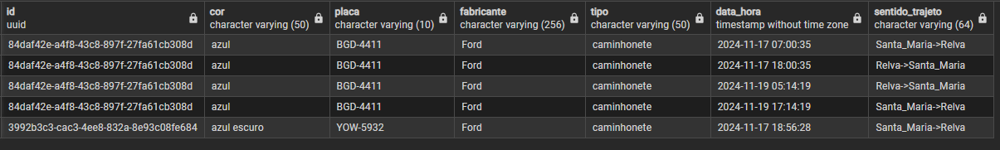

Essa consulta identificou dois veículos com as placas:
* BGD-4411
* YOW-5932

Para investigar a quem pertencia esses veículo, relacionei com a tabela <code>pessoa</code>, conforme consulta abaixo:
```
SELECT 
	p.primeiro_nome ||' '|| p.sobrenome AS nome_completo,
	p.id AS pessoa_id,
	v.id AS veiculo_id, 
	v.placa,
	ip.data_hora,
	ip.sentido_trajeto
FROM modelo_veiculo mv
	JOIN veiculo v ON v.modelo_id = mv.id 
	JOIN investigacao_pedagio ip ON ip.placa = v.placa
	JOIN proprietario_veiculo pv ON pv.veiculo_id = v.id
	JOIN proprietario_pessoa_fisica ppf ON ppf.proprietario_id = pv.proprietario_id
	JOIN pessoa p ON p.id = ppf.pessoa_id 
WHERE v.cor ILIKE 'azul%' 
	AND mv.fabricante = 'Ford'
	AND mv.tipo = 'caminhonete';
```
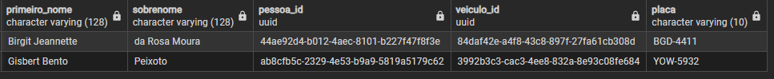

Esse filtro retornou dois proprietários:
* Birgit Jeannette da Rosa Moura 
* Gisbert Bento Peixoto

### 🚦 Movimentação de Birgit
* 17/11 – 18h00: passou de Relva para Santa Maria
* 18/11: não aparece no pedágio (dia do crime)
* 19/11 – 05h14: passou novamente de Relva para Santa Maria

### 🔍 Análises
* A presença na véspera do crime indica que o veículo já estava na área.
* A ausência no pedágio no dia do crime pode indicar tentativa de evasão.
* O retorno no dia seguinte sugere uso de rotas alternativas.

### 🚦 Movimentação de Gisbert
* 17/11 – 18h56: passou de Santa Maria para Relva
* Não aparece mais após essa data.

### 🔍 Análises
* A entrada em Relva no dia anterior é relevante, porém não há movimentação posterior.
* Sua inatividade no pedágio nos dias seguintes pode indicar tentativa de ocultação.

### 🧠 Hipóteses
* Birgit apresenta movimentação altamente suspeita e veículo 100% compatível.
* Gisbert possui o veículo compatível, mas a movimentação é limitada. Ainda assim, deve ser monitorado.

## 1.3 Relação com Compras de Vinho 
**Objetivo**: Verificar se Birgit ou Gisbert têm relação comercial com a empresa de vinhos roubada.

Para isso, utilizei a tabela principal <code>investigacao_compra</code>:
```
SELECT 
    p.id,
    p.primeiro_nome || ' ' || p.sobrenome AS nome_comprador,
    COUNT(ic.id) AS qntd_compras
FROM pessoa p
	LEFT JOIN investigacao_compra ic ON ic.pessoa_id = p.id
WHERE p.id IN (
    '44ae92d4-b012-4aec-8101-b227f47f8f3e', -- Birgit
    'ab8cfb5c-2329-4e53-b9a9-5819a5179c62'  -- Gisbert
)
AND ic.data_compra BETWEEN DATE '2024-05-18' AND DATE '2024-11-18'
GROUP BY p.id, nome_comprador
HAVING COUNT(ic.id) > 1
ORDER BY qntd_compras DESC;
```


**Resultado:** Nenhum deles aparece entre os compradores frequentes.

## 📌 Interpretação Final
* Gisbert é o principal suspeito, pois seu trânsito pela região não é recorrente, tendo passado pelo pedágio apenas uma vez, e justamente na véspera do crime — comportamento típico de quem entra no local apenas para executar uma ação.
* Birgit, apesar de ter movimentação frequente, não aparece no pedágio no dia do crime, o que pode indicar tentativa de evitar registros, mas seu padrão de deslocamento é mais habitual.
* Ambos possuem veículos compatíveis com a descrição, o que mantém os dois sob observação.
* Ambos não possuem vínculo comercial com a empresa, o que não os exclui, mas reduz a chance de ligação interna.

## 📝 Lista de Suspeitos Atual 

| ID                                   | Nome Completo                  | Justificativa    |
|--------------------------------------|--------------------------------|------------------|
| 44ae92d4-b012-4aec-8101-b227f47f8f3e | Birgit Jeannette da Rosa Moura | veículo suspeito |
| ab8cfb5c-2329-4e53-b9a9-5819a5179c62 | Gisbert Bento Peixoto          | veículo suspeito |

# 👤 2. Analisar Características Físicas dos Suspeitos
**Objetivo**: Identificar pessoas que correspondam ao perfil físico descrito pelas vítimas.

## Perfil Físico Relatado
Com base nos depoimentos, compilei as seguintes características:

| Característica    | Detalhes considerados | Justificativa                                       |
|-------------------|-----------------------|-----------------------------------------------------|
| Cor do cabelo     | vermelho, laranja     | Variação pode ser efeito da luz ou percepção        |
| Formato do cabelo | longo                 | Coincidência entre relatos                          |
| Cor da pele       | laranja               | Mencionado por uma das vítimas                      |
| Barba             | sim                   | Uma vítima citou bigode e barba, outra só barba     |
| Altura            | alto                  | Afirmado com clareza                                |
| Faixa etária      | entre 18 e 50 anos    | Compatível com o perfil típico de criminosos ativos |

> ***Observação:*** sotaque e presença de bigode foram ignorados por inconsistência nos relatos.

## 2.1. Consulta de pessoas com essas características

```
SELECT 
	p.id,
	p.data_nascimento,
	p.primeiro_nome ||' '|| p.sobrenome AS nome_completo
FROM pessoa p 
	JOIN pessoa_caracteristica pc ON pc.pessoa_id = p.id
WHERE pc.cor_cabelo IN ('vermelho', 'laranja')
	AND pc.formato_cabelo = 'longo'
	AND pc.cor_pele = 'laranja'
	AND pc.barba = 'Sim'
	AND pc.altura = 'alto'
	AND data_nascimento 
		BETWEEN 
			(DATE '2024-11-18' - INTERVAL '50 years') 
				AND 
			(DATE '2024-11-18' - INTERVAL '18 years')
ORDER BY p.primeiro_nome;			
```
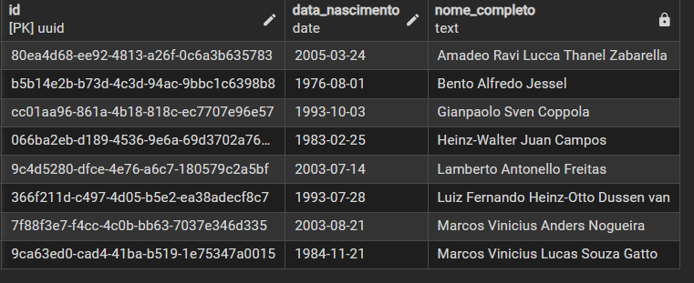

**Resultado:** 8 pessoas foram encontradas com essas características.
* Amadeo Ravi Lucca Thanel Zabarella 
* Bento Alfredo Jessel 
* Gianpaolo Sven Coppola 
* Heinz-Walter Juan Campos 
* Lamberto Antonello Freitas
* Luiz Fernando Heinz-Otto Dussen van 
* Marcos Vinicius Anders Nogueira 
* Marcos Vinicius Lucas Souza Gatto

## 2.2. Relação com Compras de Vinho

Para investigar se o suspeito com essas características tinha envolvimento com compras de vinho (e, portanto, com a empresa roubada), fiz o cruzamento com a tabela <code>investigacao_compra</code>:
```
SELECT 
    p.id AS id_comprador,
    p.nome AS nome_comprador,
    COUNT(ic.id) AS qntd_compras
FROM pessoa p
	JOIN investigacao_compra ic ON ic.pessoa_id = p.id
	JOIN pessoa_caracteristica pc ON pc.pessoa_id = p.id
WHERE ic.data_compra 
	BETWEEN 
		DATE '2024-05-18' 
			AND 
		DATE '2024-11-18'
	AND pc.cor_cabelo IN ('vermelho', 'laranja')
	AND pc.formato_cabelo = 'longo'
	AND pc.cor_pele = 'laranja'
	AND pc.barba = 'Sim'
	AND pc.altura = 'alto'
	AND data_nascimento 
		BETWEEN 
			(DATE '2024-11-18' - INTERVAL '50 years') 
				AND 
			(DATE '2024-11-18' - INTERVAL '18 years')
GROUP BY p.id, p.nome
HAVING COUNT(ic.id) > 1
ORDER BY qntd_compras DESC;
```


**Resultado**: Nenhum desses suspeitos aparece como comprador recorrente.

## 📌 Interpretação Final
* Temos 8 indivíduos com todas as características físicas relatadas.
* Nenhum aparece com frequência como comprador de vinho.
* Apesar disso, o alto grau de compatibilidade com os depoimentos justifica manter esses nomes sob observação.

## 📝 Lista de Suspeitos Atual 

| ID                                   | Nome Completo                       | Justificativa                  |
|--------------------------------------|-------------------------------------|--------------------------------|
| 44ae92d4-b012-4aec-8101-b227f47f8f3e | Birgit Jeannette da Rosa Moura      | veículo suspeito               |
| ab8cfb5c-2329-4e53-b9a9-5819a5179c62 | Gisbert Bento Peixoto               | veículo suspeito               |
| 80ea4d68-ee92-4813-a26f-0c6a3b635783 | Amadeo Ravi Lucca Thanel Zabarella  | característica física suspeita |
| b5b14e2b-b73d-4c3d-94ac-9bbc1c6398b8 | Bento Alfredo Jessel                | característica física suspeita |
| cc01aa96-861a-4b18-818c-ec7707e96e57 | Gianpaolo Sven Coppola              | característica física suspeita |
| 066ba2eb-d189-4536-9e6a-69d3702a7622 | Heinz-Walter Juan Campos            | característica física suspeita |
| 9c4d5280-dfce-4e76-a6c7-180579c2a5bf | Lamberto Antonello Freitas          | característica física suspeita |
| 366f211d-c497-4d05-b5e2-ea38adecf8c7 | Luiz Fernando Heinz-Otto Dussen van | característica física suspeita |
| 7f88f3e7-f4cc-4c0b-bb63-7037e346d335 | Marcos Vinicius Anders Nogueira     | característica física suspeita |
| 9ca63ed0-cad4-41ba-b519-1e75347a0015 | Marcos Vinicius Lucas Souza Gatto   | característica física suspeita |


# 📞 3. Analisar Ligações Suspeitas
**Objetivo**: Verificar se há conexões telefônicas entre os suspeitos (com base em veículo ou características físicas) e funcionários da empresa. O foco é identificar cúmplices ou vínculos que reforcem a participação no crime. 

## 3.1. Veículo suspeito × Características físicas
**Objetivo**: Verificar se os donos de veículo compatível com a cena do crime trocaram ligações com pessoas com aparência semelhante à descrita pelas vítimas, indicando possível cúmplice ou autor direto do assalto.
```
SELECT DISTINCT 
    p1.id AS suspeito_veiculo_id,
    p1.primeiro_nome || ' ' || p1.sobrenome AS nome_suspeito_veiculo,
    p2.id AS suspeito_fisico_id,
    p2.primeiro_nome || ' ' || p2.sobrenome AS nome_suspeito_caracteristica,
    it.data_hora,
    it.origem_telefone_id,
    it.destino_telefone_id
FROM pessoa p1
LEFT JOIN proprietario_pessoa_fisica ppf1 ON ppf1.pessoa_id = p1.id
LEFT JOIN proprietario_telefone pt1 ON pt1.proprietario_id = ppf1.proprietario_id
LEFT JOIN investigacao_telefone it ON it.origem_telefone_id = pt1.telefone_id 
                                   OR it.destino_telefone_id = pt1.telefone_id
LEFT JOIN proprietario_telefone pt2 ON pt2.telefone_id = it.origem_telefone_id 
                                   OR pt2.telefone_id = it.destino_telefone_id
LEFT JOIN proprietario_pessoa_fisica ppf2 ON ppf2.proprietario_id = pt2.proprietario_id
LEFT JOIN pessoa p2 ON p2.id = ppf2.pessoa_id
LEFT JOIN pessoa_caracteristica pc ON pc.pessoa_id = p2.id
WHERE p1.id IN (
    '44ae92d4-b012-4aec-8101-b227f47f8f3e',  -- Birgit
    'ab8cfb5c-2329-4e53-b9a9-5819a5179c62'   -- Gisbert
)
AND (
    pc.cor_cabelo IN ('vermelho', 'laranja')
    AND pc.formato_cabelo = 'longo'
    AND pc.cor_pele = 'laranja'
    AND pc.barba = 'Sim'
    AND pc.altura = 'alto'
    AND p2.data_nascimento BETWEEN DATE '1974-11-18' AND DATE '2006-11-18'
    OR pc.pessoa_id IS NULL  
);
```
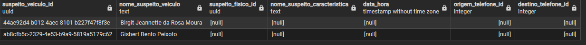

**Resultado:** Nenhuma ligação foi registrada entre os donos dos veículos e os suspeitos com as características físicas. Além disso, Birgit e Gisbert não possuem telefone cadastrado — o que levanta suspeita, mas ao mesmo tempo limita as possibilidades de conexão direta com outros envolvidos.

## 3.2.  Funcionários Transporte × Suspeitos físicos
Como já sabemos que Birgit e Gisbert não possuem telefone, podemos descartar a conexão entre eles e os funcionários. À vista disso, fiz o cruzamento entre os funcionários e os suspeitos com as características físicas utilizando as tabelas principais <code>investigação_pessoa_transporte</code> e <code>investigacao_telefone</code>.
```
SELECT DISTINCT 
	p1.id AS colaborador_id,
	p1.primeiro_nome ||' '|| p1.sobrenome AS nome_colaborador,
	p2.id AS suspeito_id,
	p2.primeiro_nome ||' '|| p2.sobrenome AS nome_suspeito,
	it.data_hora,
	it.origem_telefone_id,
	it.destino_telefone_id
FROM investigacao_pessoa_transporte ipt
	JOIN pessoa p1 ON p1.id = ipt.pessoa_id
	JOIN proprietario_pessoa_fisica ppf ON ppf.pessoa_id = p1.id
	JOIN proprietario_telefone pt1 ON pt1.proprietario_id = ppf.proprietario_id
	JOIN investigacao_telefone it ON it.origem_telefone_id = pt1.telefone_id OR it.destino_telefone_id = pt1.telefone_id
	JOIN proprietario_telefone pt2 ON (pt2.telefone_id = it.origem_telefone_id OR pt2.telefone_id = it.destino_telefone_id)
	JOIN proprietario_pessoa_fisica ppf2 ON ppf2.proprietario_id = pt2.proprietario_id
	JOIN pessoa p2 ON p2.id = ppf2.pessoa_id
	JOIN pessoa_caracteristica pc ON pc.pessoa_id = p2.id
WHERE pc.cor_cabelo IN ('vermelho', 'laranja')
	AND pc.formato_cabelo = 'longo'
	AND pc.cor_pele = 'laranja'
	AND pc.barba = 'Sim'
	AND pc.altura = 'alto'
	AND p2.data_nascimento BETWEEN DATE '1974-11-18' AND DATE '2006-11-18';
```	
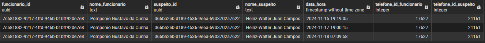

**Resultado**: O funcionário Pomponio Gustavo da Cunha fez ligações para Heinz-Walter Juan Campos, um dos suspeitos que corresponde exatamente à descrição das vítimas.

### 🔍 Análises:
* As ligações ocorreram em 15/11, 17/11 e 18/11 — sendo esta última menos de 3 horas antes do crime;
* Pomponio estava no caminhão no momento do roubo e foi o único que não comentou sobre a aparência dos assaltantes;
* Heinz-Walter é fortemente suspeito de ser o autor direto, e Pomponio, cúmplice.

### 🧠 Hipóteses
* Heinz-Walter Juan Campos ganha força como principal autor do crime;
* Pomponio Gustavo da Cunha pode ser informante ou facilitador interno;
* A ausência de telefone de Birgit e Gisbert não elimina a suspeita, mas impede que sejam conectados diretamente por chamadas;
* A relação entre colaboradores e suspeitos com perfis físicos confirma planejamento e comunicação prévia.

## 📝 Lista de Suspeitos Atual 

| ID                                   | Nome Completo                       | Justificativa                            |
|--------------------------------------|-------------------------------------|------------------------------------------|
| 44ae92d4-b012-4aec-8101-b227f47f8f3e | Birgit Jeannette da Rosa Moura      | veículo suspeito                         |
| ab8cfb5c-2329-4e53-b9a9-5819a5179c62 | Gisbert Bento Peixoto               | veículo suspeito                         |
| 80ea4d68-ee92-4813-a26f-0c6a3b635783 | Amadeo Ravi Lucca Thanel Zabarella  | característica física suspeita           |
| b5b14e2b-b73d-4c3d-94ac-9bbc1c6398b8 | Bento Alfredo Jessel                | característica física suspeita           |
| cc01aa96-861a-4b18-818c-ec7707e96e57 | Gianpaolo Sven Coppola              | característica física suspeita           |
| 066ba2eb-d189-4536-9e6a-69d3702a7622 | Heinz-Walter Juan Campos            | característica física e ligação suspeita |
| 9c4d5280-dfce-4e76-a6c7-180579c2a5bf | Lamberto Antonello Freitas          | característica física suspeita           |
| 366f211d-c497-4d05-b5e2-ea38adecf8c7 | Luiz Fernando Heinz-Otto Dussen van | característica física suspeita           |
| 7f88f3e7-f4cc-4c0b-bb63-7037e346d335 | Marcos Vinicius Anders Nogueira     | característica física suspeita           |
| 9ca63ed0-cad4-41ba-b519-1e75347a0015 | Marcos Vinicius Lucas Souza Gatto   | característica física suspeita           |
| 7c681882-9217-4ffd-946b-b1bff920e7e8 | Pomponio Gustavo da Cunha           | ligação suspeita                         |

## 3.3. Ligações do Telefone do Suspeito
**Objetivo:** Analisar os registros de chamadas feitas por Heinz-Walter Juan Campos entre 14 e 21 de novembro de 2024, a fim de detectar movimentações suspeitas ou conexões com outros envolvidos.

Consulta SQL utilizada:

```
SELECT  
    COALESCE(p.id, e.id) AS id_entidade,
    COALESCE(p.primeiro_nome || ' ' || p.sobrenome, e.nome) AS nome,
    CASE 
        WHEN p.id IS NOT NULL THEN 'Pessoa Física'
        ELSE 'Pessoa Jurídica'
    END AS tipo,
    i.origem_telefone_id,
    i.destino_telefone_id,
    i.data_hora
FROM proprietario pr
    LEFT JOIN proprietario_pessoa_fisica f ON f.proprietario_id = pr.id
    LEFT JOIN pessoa p ON p.id = f.pessoa_id
    LEFT JOIN proprietario_pessoa_juridica pj ON pj.proprietario_id = pr.id
    LEFT JOIN empresa e ON e.id = pj.empresa_id
    JOIN proprietario_telefone pt ON pt.proprietario_id = pr.id
    JOIN investigacao_telefone i ON i.origem_telefone_id = pt.telefone_id 
WHERE i.data_hora BETWEEN '2024-11-14 00:00:00' AND '2024-11-21 00:00:00'
	AND pt.telefone_id = 21161 -- telefone de Heinz-Walter
ORDER BY tipo DESC, nome, data_hora;
```
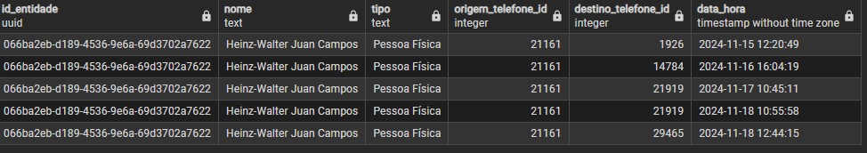

As chamadas nos dias 17 e 18 sugerem forte envolvimento. A repetição do número 21919 e o horário das ligações (antes e depois do assalto) são indicativos de contato direto com um possível cúmplice.

## 3.4. Identificação dos Destinatários
**Objetivo:** Descobrir quem são os proprietários dos telefones envolvidos e quais são seus registros de ligações.

### 3.4.1. Telefone 1926:
Consultando a tabela principal <code>proprietario_telefone</code>:
```
SELECT 
	COALESCE(p.id, e.id) AS id_proprietario,
	COALESCE(p.primeiro_nome ||' '|| p.sobrenome, e.nome) AS nome_proprietario,
	p.profissao,
	CASE
		WHEN p.id IS NOT NULL THEN 'Pessoa Física'
		ELSE 'Pessoa Jurídica'
	END AS tipo	
FROM proprietario_telefone pt 
	LEFT JOIN proprietario_pessoa_fisica ppf ON ppf.proprietario_id = pt.proprietario_id
	LEFT JOIN pessoa p ON p.id = ppf.pessoa_id
	LEFT JOIN proprietario_pessoa_juridica ppj ON ppj.proprietario_id = pt.proprietario_id
	LEFT JOIN empresa e ON e.id = ppj.empresa_id
WHERE pt.telefone_id = 1926;
```
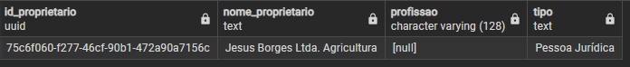

**Resultado:** A consulta retornou a empresa Jesus Borges Ltda. Agricultura

Com base no resultado, consultei a relação da empresa com os maiores compradores de vinho:
```
SELECT 
    COALESCE(p.id, e.id) AS id_comprador,
    COALESCE(p.primeiro_nome || ' ' || p.sobrenome, e.nome) AS nome_comprador,
    COUNT(ic.id) AS qntd_compras,
    CASE 
        WHEN p.id IS NOT NULL THEN 'Pessoa Física'
        ELSE 'Pessoa Jurídica'
    END AS tipo
FROM investigacao_compra ic
    LEFT JOIN pessoa p ON p.id = ic.pessoa_id
    LEFT JOIN empresa e ON e.id = ic.pessoa_id
WHERE ic.data_compra BETWEEN DATE '2024-05-18' AND DATE '2024-11-18'
	AND e.id = '75c6f060-f277-46cf-90b1-472a90a7156c'
GROUP BY COALESCE(p.id, e.id), COALESCE(p.primeiro_nome || ' ' || p.sobrenome, e.nome), tipo
HAVING COUNT(ic.id) > 1
ORDER BY qntd_compras DESC;
```


**Resultado:** A empresa não está entre os maiores compradores de vinho.

Depois, fui em busca de descobrir quem era o proprietário daquela empresa:
```
SELECT 
	p.id, 
	p.primeiro_nome, 
	p.sobrenome, 
	p.profissao
FROM pessoa p 
	JOIN proprietario_pessoa_fisica ppf ON ppf.pessoa_id = p.id
	JOIN proprietario_empresa pe ON pe.proprietario_id = ppf.proprietario_id 
	JOIN empresa e ON e.id = pe.empresa_id
WHERE e.id = '75c6f060-f277-46cf-90b1-472a90a7156c';
```
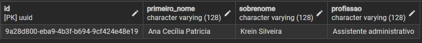

**Resultado:** A consulta retornou a proprietária Ana Cecília Patricia Krein Silveira que atua como Assistente Administrativo.

Verifiquei se era proprietária de algum telefone:
```
SELECT 
	COALESCE(p.id, e.id) AS id_proprietario,
	COALESCE(p.primeiro_nome ||' '|| p.sobrenome, e.nome) AS nome_proprietario,
	p.profissao,
	CASE
		WHEN p.id IS NOT NULL THEN 'Pessoa Física'
		ELSE 'Pessoa Jurídica'
	END AS tipo	
FROM proprietario_telefone pt 
	LEFT JOIN proprietario_pessoa_fisica ppf ON ppf.proprietario_id = pt.proprietario_id
	LEFT JOIN pessoa p ON p.id = ppf.pessoa_id
	LEFT JOIN proprietario_pessoa_juridica ppj ON ppj.proprietario_id = pt.proprietario_id
	LEFT JOIN empresa e ON e.id = ppj.empresa_id
WHERE p.id = '9a28d800-eba9-4b3f-b694-9cf424e48e19';
```


**Resultado:** Ana Cecília não possui telefone de pessoa física

```
SELECT  
    COALESCE(p.id, e.id) AS id_entidade,
    COALESCE(p.primeiro_nome || ' ' || p.sobrenome, e.nome) AS nome,
    CASE 
        WHEN p.id IS NOT NULL THEN 'Pessoa Física'
        ELSE 'Pessoa Jurídica'
    END AS tipo,
    i.origem_telefone_id,
    i.destino_telefone_id,
    i.data_hora
FROM proprietario pr
    LEFT JOIN proprietario_pessoa_fisica f ON f.proprietario_id = pr.id
    LEFT JOIN pessoa p ON p.id = f.pessoa_id
    LEFT JOIN proprietario_pessoa_juridica pj ON pj.proprietario_id = pr.id
    LEFT JOIN empresa e ON e.id = pj.empresa_id
    JOIN proprietario_telefone pt ON pt.proprietario_id = pr.id
    JOIN investigacao_telefone i ON i.origem_telefone_id = pt.telefone_id
WHERE i.data_hora BETWEEN '2024-11-14 00:00:00' AND '2024-11-21 00:00:00'
	AND telefone_id = 1926
ORDER BY tipo DESC, nome, data_hora;
```
```
SELECT  
    COALESCE(p.id, e.id) AS id_entidade,
    COALESCE(p.primeiro_nome || ' ' || p.sobrenome, e.nome) AS nome,
    CASE 
        WHEN p.id IS NOT NULL THEN 'Pessoa Física'
        ELSE 'Pessoa Jurídica'
    END AS tipo,
    i.origem_telefone_id,
    i.destino_telefone_id,
    i.data_hora
FROM proprietario pr
    LEFT JOIN proprietario_pessoa_fisica f ON f.proprietario_id = pr.id
    LEFT JOIN pessoa p ON p.id = f.pessoa_id
    LEFT JOIN proprietario_pessoa_juridica pj ON pj.proprietario_id = pr.id
    LEFT JOIN empresa e ON e.id = pj.empresa_id
    JOIN proprietario_telefone pt ON pt.proprietario_id = pr.id
    JOIN investigacao_telefone i ON i.destino_telefone_id = pt.telefone_id
WHERE i.data_hora BETWEEN '2024-11-14 00:00:00' AND '2024-11-21 00:00:00'
	AND telefone_id = 1926
ORDER BY tipo DESC, nome, data_hora;
```

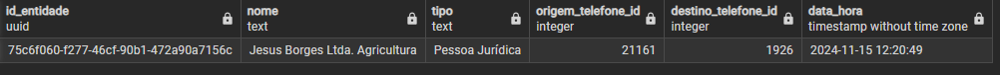

**Resultado:** Não há registros de chamadas além daquela que vimos entre ele e o Heinz-Walter.

Ou seja, Ana Cecília apenas recebeu ligações pelo telefone da sua empresa.

Por fim, consultei suas relações:
```
SELECT DISTINCT
	p.id,
	p.primeiro_nome ||' '|| p.sobrenome AS nome_completo,
	p.profissao,
	pr.tipo_relacao
FROM pessoa p
	JOIN pessoa_relacao pr ON pr.pessoa_id_relacao = p.id
WHERE pr.pessoa_id = '9a28d800-eba9-4b3f-b694-9cf424e48e19'
	AND pr.tipo_relacao IN ('Maternidade', 'Paternidade', 'Casamento')
ORDER BY nome_completo, p.id, p.profissao;

```


**Resultado:** Não possui nenhum tipo de relação

#### 🔍 Análises
* Proprietário: Jesus Borges Ltda. (empresa agrícola)
* Proprietário legal: Ana Cecília Patricia Krein Silveira (Assistente Administrativo)
* Participação comercial: Não figura entre os maiores compradores
* Outras chamadas: Nenhuma
* Relações registradas: Nenhuma
* Ligação pontual, sem padrão de atividade. 
* Conexão direta com Heinz-Walter e nenhum histórico que justifique o contato.

### 3.4.2. Telefone com ID 14784:
Consultando a tabela principal <code>proprietario_telefone</code>:
```
SELECT 
	COALESCE(p.id, e.id) AS id_proprietario,
	COALESCE(p.primeiro_nome ||' '|| p.sobrenome, e.nome) AS nome_proprietario,
	p.profissao,
	CASE
		WHEN p.id IS NOT NULL THEN 'Pessoa Física'
		ELSE 'Pessoa Jurídica'
	END AS tipo	
FROM proprietario_telefone pt 
	LEFT JOIN proprietario_pessoa_fisica ppf ON ppf.proprietario_id = pt.proprietario_id
	LEFT JOIN pessoa p ON p.id = ppf.pessoa_id
	LEFT JOIN proprietario_pessoa_juridica ppj ON ppj.proprietario_id = pt.proprietario_id
	LEFT JOIN empresa e ON e.id = ppj.empresa_id
WHERE pt.telefone_id = 14784;
```
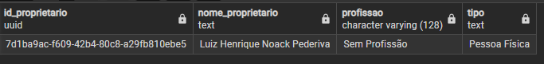

**Resultado:** retornou o nome Luiz Henrique Noack Pedriva, a qual não possui profissão. 

Verifiquei se possui relação entre os maiores compradores de vinho:
```
SELECT 
    COALESCE(p.id, e.id) AS id_comprador,
    COALESCE(p.primeiro_nome || ' ' || p.sobrenome, e.nome) AS nome_comprador,
    COUNT(ic.id) AS qntd_compras,
    CASE 
        WHEN p.id IS NOT NULL THEN 'Pessoa Física'
        ELSE 'Pessoa Jurídica'
    END AS tipo
FROM investigacao_compra ic
    LEFT JOIN pessoa p ON p.id = ic.pessoa_id
    LEFT JOIN empresa e ON e.id = ic.pessoa_id
WHERE ic.data_compra BETWEEN DATE '2024-05-18' AND DATE '2024-11-18'
	AND p.id = '7d1ba9ac-f609-42b4-80c8-a29fb810ebe5'
GROUP BY COALESCE(p.id, e.id), COALESCE(p.primeiro_nome || ' ' || p.sobrenome, e.nome), tipo
HAVING COUNT(ic.id) > 1
ORDER BY qntd_compras DESC;
```


**Resultado:** Não está entre os maiores compradores

Conferi seus registros telefônicos
```
SELECT  
    COALESCE(p.id, e.id) AS id_entidade,
    COALESCE(p.primeiro_nome || ' ' || p.sobrenome, e.nome) AS nome,
    CASE 
        WHEN p.id IS NOT NULL THEN 'Pessoa Física'
        ELSE 'Pessoa Jurídica'
    END AS tipo,
    i.origem_telefone_id,
    i.destino_telefone_id,
    i.data_hora
FROM proprietario pr
    LEFT JOIN proprietario_pessoa_fisica f ON f.proprietario_id = pr.id
    LEFT JOIN pessoa p ON p.id = f.pessoa_id
    LEFT JOIN proprietario_pessoa_juridica pj ON pj.proprietario_id = pr.id
    LEFT JOIN empresa e ON e.id = pj.empresa_id
    JOIN proprietario_telefone pt ON pt.proprietario_id = pr.id
    JOIN investigacao_telefone i ON i.origem_telefone_id = pt.telefone_id 
WHERE i.data_hora BETWEEN '2024-11-14 00:00:00' AND '2024-11-21 00:00:00'
	AND pt.telefone_id = 14784
ORDER BY tipo DESC, nome, data_hora;
```
```
SELECT  
    COALESCE(p.id, e.id) AS id_entidade,
    COALESCE(p.primeiro_nome || ' ' || p.sobrenome, e.nome) AS nome,
    CASE 
        WHEN p.id IS NOT NULL THEN 'Pessoa Física'
        ELSE 'Pessoa Jurídica'
    END AS tipo,
    i.origem_telefone_id,
    i.destino_telefone_id,
    i.data_hora
FROM proprietario pr
    LEFT JOIN proprietario_pessoa_fisica f ON f.proprietario_id = pr.id
    LEFT JOIN pessoa p ON p.id = f.pessoa_id
    LEFT JOIN proprietario_pessoa_juridica pj ON pj.proprietario_id = pr.id
    LEFT JOIN empresa e ON e.id = pj.empresa_id
    JOIN proprietario_telefone pt ON pt.proprietario_id = pr.id
    JOIN investigacao_telefone i ON i.destino_telefone_id = pt.telefone_id 
WHERE i.data_hora BETWEEN '2024-11-14 00:00:00' AND '2024-11-21 00:00:00'
	AND pt.telefone_id = 14784
ORDER BY tipo DESC, nome, data_hora;
```
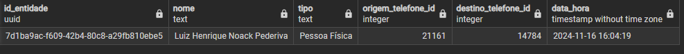

**Resultado:** Não há registros de ligação além do número de Heinz-Walter. 

Posteriormente, consultei suas relações:
```
SELECT DISTINCT
	p.id,
	p.primeiro_nome ||' '|| p.sobrenome AS nome_completo,
	p.profissao,
	pr.tipo_relacao
FROM pessoa p
	JOIN pessoa_relacao pr ON pr.pessoa_id_relacao = p.id
WHERE pr.pessoa_id = '7d1ba9ac-f609-42b4-80c8-a29fb810ebe5'
	AND pr.tipo_relacao IN ('Maternidade', 'Paternidade', 'Casamento')
ORDER BY nome_completo, p.id, p.profissao;
```


**Resultado:** Não possui nenhum tipo de relação 

#### 🔍 Análises
* Proprietário: Luiz Henrique Noack Pedriva (sem profissão)
* Outras ligações: Nenhuma além do contato com Heinz-Walter
* Relações registradas: Nenhuma
* Não consta nas listas de suspeitos nem de compradores relevantes
* Mesmo padrão: contato pontual, fora de qualquer rotina esperada.


#### 🧠 Hipóteses 
* Ambos os contatos feitos por Heinz-Walter (IDs 1926 e 14784) ocorreram poucos dias antes do crime, sem qualquer justificativa plausível. Nenhum deles apresenta atividade telefônica além do contato com Heinz-Walter, o que sugere comunicação intencional e altamente controlada.
* A ausência de histórico anterior ou posterior a essas ligações fortalece a hipótese de que se tratam de contatos ligados diretamente à ação criminosa.

### 3.4.3. Telefone com ID 21919:
Consultando a tabela principal <code>proprietario_telefone</code>:
```
SELECT 
	COALESCE(p.id, e.id) AS id_proprietario,
	COALESCE(p.primeiro_nome ||' '|| p.sobrenome, e.nome) AS nome_proprietario,
	p.profissao,
	CASE
		WHEN p.id IS NOT NULL THEN 'Pessoa Física'
		ELSE 'Pessoa Jurídica'
	END AS tipo	
FROM proprietario_telefone pt 
	LEFT JOIN proprietario_pessoa_fisica ppf ON ppf.proprietario_id = pt.proprietario_id
	LEFT JOIN pessoa p ON p.id = ppf.pessoa_id
	LEFT JOIN proprietario_pessoa_juridica ppj ON ppj.proprietario_id = pt.proprietario_id
	LEFT JOIN empresa e ON e.id = ppj.empresa_id
WHERE pt.telefone_id = 21919;
```
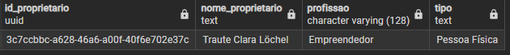

**Resultado:** A consulta retorna o nome Traute Clara Löchel, a qual atua como empreendedora - o que levanta a hipótese de que talvez possua uma empresa.

Consultando a tabela principal <code>proprietario_empresa</code>:
```
SELECT 
	p.id,
	p.primeiro_nome, 
	p.sobrenome, 
	e.id AS id_empresa,
	e.nome AS empresa
FROM pessoa p 
	JOIN proprietario_pessoa_fisica ppf ON ppf.pessoa_id = p.id
	JOIN proprietario_empresa pe ON pe.proprietario_id = ppf.proprietario_id
	JOIN empresa e ON e.id = pe.empresa_id
WHERE p.id = '3c7ccbbc-a628-46a6-a00f-40f6e702e37c';	
```
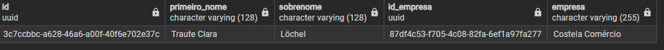

**Resultado**: Traute Clara possui uma empresa chamada Costela Comércio. A empresa pode estar presente nos maiores compradores de vinho.

Consultando a tabela principal <code>investigacao_compra</code>:
```
SELECT 
    COALESCE(p.id, e.id) AS id_comprador,
    COALESCE(p.primeiro_nome || ' ' || p.sobrenome, e.nome) AS nome_comprador,
    COUNT(ic.id) AS qntd_compras,
    CASE 
        WHEN p.id IS NOT NULL THEN 'Pessoa Física'
        ELSE 'Pessoa Jurídica'
    END AS tipo
FROM investigacao_compra ic
    LEFT JOIN pessoa p ON p.id = ic.pessoa_id
    LEFT JOIN empresa e ON e.id = ic.pessoa_id
WHERE ic.data_compra BETWEEN DATE '2024-05-18' AND DATE '2024-11-18'
	AND e.id = '87df4c53-f705-4c08-82fa-6ef1a97fa277'
GROUP BY COALESCE(p.id, e.id), COALESCE(p.primeiro_nome || ' ' || p.sobrenome, e.nome), tipo
HAVING COUNT(ic.id) > 1
ORDER BY qntd_compras DESC;
```
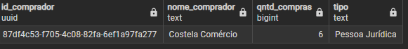

**Resultado:** A empresa está presente na tabela de maiores compradoras de vinho constando um total de 6 compras nos últimos 6 meses - uma média de 1 compra por mês. Isso indica envolvimento direto com a carga roubada.

Verifiquei seus registros de ligações:
```
SELECT  
    COALESCE(p.id, e.id) AS id_entidade,
    COALESCE(p.primeiro_nome || ' ' || p.sobrenome, e.nome) AS nome,
    CASE 
        WHEN p.id IS NOT NULL THEN 'Pessoa Física'
        ELSE 'Pessoa Jurídica'
    END AS tipo,
    i.origem_telefone_id,
    i.destino_telefone_id,
    i.data_hora
FROM proprietario pr
    LEFT JOIN proprietario_pessoa_fisica f ON f.proprietario_id = pr.id
    LEFT JOIN pessoa p ON p.id = f.pessoa_id
    LEFT JOIN proprietario_pessoa_juridica pj ON pj.proprietario_id = pr.id
    LEFT JOIN empresa e ON e.id = pj.empresa_id
    JOIN proprietario_telefone pt ON pt.proprietario_id = pr.id
    JOIN investigacao_telefone i ON i.origem_telefone_id = pt.telefone_id
WHERE i.data_hora BETWEEN '2024-11-14 00:00:00' AND '2024-11-21 00:00:00'
  AND telefone_id = 21919
ORDER BY tipo DESC, nome, data_hora;
```
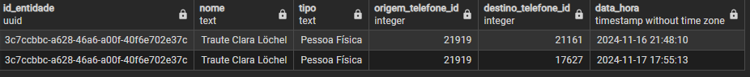

**Resultado:** 
* Em 16/11, ligou para Heinz-Walter às 21h55 — 2 dias antes do crime.
* Em 17/11, ligou para Pomponio às 17h54 — véspera do crime. 

Ambos os alvos têm envolvimento suspeito. Isso evidencia que Traute estava coordenando ou ao menos envolvida com o grupo.

Posteriormente, conferi suas relações:
```
SELECT DISTINCT
	p.id,
	p.primeiro_nome ||' '|| p.sobrenome AS nome_completo,
	p.profissao,
	pr.tipo_relacao
FROM pessoa p
	JOIN pessoa_relacao pr ON pr.pessoa_id_relacao = p.id
WHERE pr.pessoa_id = '3c7ccbbc-a628-46a6-a00f-40f6e702e37c'
	AND pr.tipo_relacao IN ('Maternidade', 'Paternidade', 'Casamento')
ORDER BY nome_completo, p.id, p.profissao;
```
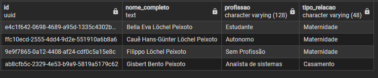

**Resultado:** 
* Filhos: Bella Eva Löchel Peixoto, Cauê Hans-Günter Löchel Peixoto e Filippo Löchel Peixoto. Nenhum com envolvimento empresarial.
* Cônjuge: Gisbert Bento Peixoto — analista de sistemas e suspeito com veículo rastreado indo para Relva.

#### 🧠 Hipóteses
* Fortes indícios de que Traute, Gisbert e Heinz-Walter estavam envolvidos diretamente no crime. Pomponio pode ter sido usado como elo intermediário.
* Traute é proprietária de uma empresa  que está entre os maiores compradores de vinho - o que justifica seu interesse em participar do crime. 

### 3.4.4. Telefone com ID 29465:
Consultando a tabela principal <code>proprietario_telefone</code>:
```
SELECT 
	COALESCE(p.id, e.id) AS id_proprietario,
	COALESCE(p.primeiro_nome ||' '|| p.sobrenome, e.nome) AS nome_proprietario,
	p.profissao,
	CASE
		WHEN p.id IS NOT NULL THEN 'Pessoa Física'
		ELSE 'Pessoa Jurídica'
	END AS tipo	
FROM proprietario_telefone pt 
	LEFT JOIN proprietario_pessoa_fisica ppf ON ppf.proprietario_id = pt.proprietario_id
	LEFT JOIN pessoa p ON p.id = ppf.pessoa_id
	LEFT JOIN proprietario_pessoa_juridica ppj ON ppj.proprietario_id = pt.proprietario_id
	LEFT JOIN empresa e ON e.id = ppj.empresa_id
WHERE pt.telefone_id = 29465;
```
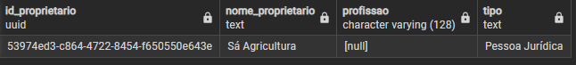

**Resultado:** A consulta retorna a empresa Sá Agricultura.

Verifiquei se a empresa está entre os maiores compradores:
```
SELECT 
    COALESCE(p.id, e.id) AS id_comprador,
    COALESCE(p.primeiro_nome || ' ' || p.sobrenome, e.nome) AS nome_comprador,
    COUNT(ic.id) AS qntd_compras,
    CASE 
        WHEN p.id IS NOT NULL THEN 'Pessoa Física'
        ELSE 'Pessoa Jurídica'
    END AS tipo
FROM investigacao_compra ic
    LEFT JOIN pessoa p ON p.id = ic.pessoa_id
    LEFT JOIN empresa e ON e.id = ic.pessoa_id
WHERE ic.data_compra BETWEEN DATE '2024-05-18' AND DATE '2024-11-18'
	AND e.id = '53974ed3-c864-4722-8454-f650550e643e'
GROUP BY COALESCE(p.id, e.id), COALESCE(p.primeiro_nome || ' ' || p.sobrenome, e.nome), tipo
HAVING COUNT(ic.id) > 1
ORDER BY qntd_compras DESC;
```


**Resultado:** Não retornou nenhuma relação com a tabela de maiores compradores de vinho.

Posteriormente, consultei o proprietário da empresa:
```
SELECT 
  p.id, 
  p.primeiro_nome, 
  p.sobrenome, 
  p.profissao
FROM pessoa p 
  JOIN proprietario_pessoa_fisica ppf ON ppf.pessoa_id = p.id
  JOIN proprietario_empresa pe ON pe.proprietario_id = ppf.proprietario_id 
  JOIN empresa e ON e.id = pe.empresa_id
WHERE e.id = '53974ed3-c864-4722-8454-f650550e643e';
```
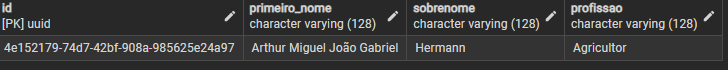

**Resultado:** Retornou o nome Arthur Miguel João Gabriel Hermann, o qual atua como agricultor. 

Em seguida, verifiquei se era proprietário de algum telefone:
```
SELECT 
	COALESCE(p.id, e.id) AS id_proprietario,
	COALESCE(p.primeiro_nome ||' '|| p.sobrenome, e.nome) AS nome_proprietario,
	p.profissao,
	CASE
		WHEN p.id IS NOT NULL THEN 'Pessoa Física'
		ELSE 'Pessoa Jurídica'
	END AS tipo	
FROM proprietario_telefone pt 
	LEFT JOIN proprietario_pessoa_fisica ppf ON ppf.proprietario_id = pt.proprietario_id
	LEFT JOIN pessoa p ON p.id = ppf.pessoa_id
	LEFT JOIN proprietario_pessoa_juridica ppj ON ppj.proprietario_id = pt.proprietario_id
	LEFT JOIN empresa e ON e.id = ppj.empresa_id
WHERE p.id = '4e152179-74d7-42bf-908a-985625e24a97';
```


**Resultado:** Arthur não possui telefone de pessoa física.

```
SELECT  
    COALESCE(p.id, e.id) AS id_entidade,
    COALESCE(p.primeiro_nome || ' ' || p.sobrenome, e.nome) AS nome,
    CASE 
        WHEN p.id IS NOT NULL THEN 'Pessoa Física'
        ELSE 'Pessoa Jurídica'
    END AS tipo,
    i.origem_telefone_id,
    i.destino_telefone_id,
    i.data_hora
FROM proprietario pr
    LEFT JOIN proprietario_pessoa_fisica f ON f.proprietario_id = pr.id
    LEFT JOIN pessoa p ON p.id = f.pessoa_id
    LEFT JOIN proprietario_pessoa_juridica pj ON pj.proprietario_id = pr.id
    LEFT JOIN empresa e ON e.id = pj.empresa_id
    JOIN proprietario_telefone pt ON pt.proprietario_id = pr.id
    JOIN investigacao_telefone i ON i.origem_telefone_id = pt.telefone_id
WHERE i.data_hora BETWEEN '2024-11-14 00:00:00' AND '2024-11-21 00:00:00'
	AND telefone_id = 29465
ORDER BY tipo DESC, nome, data_hora;
```


Além disso, o telefone jurídico da sua empresa não possui registros além daquele feito pelo Heinz-Walter.

Analisei suas relações:
```
SELECT DISTINCT
	p.id,
	p.primeiro_nome ||' '|| p.sobrenome AS nome_completo,
	p.profissao,
	pr.tipo_relacao
FROM pessoa p
	JOIN pessoa_relacao pr ON pr.pessoa_id_relacao = p.id
WHERE pr.pessoa_id = '4e152179-74d7-42bf-908a-985625e24a97'
	AND pr.tipo_relacao IN ('Maternidade', 'Paternidade', 'Casamento')
ORDER BY nome_completo, p.id, p.profissao;
```


**Resultado:** Arthur é pai de 3 filhos, sendo eles: Eugenia Lara Travaglia Hermann, Jiri Gael Henrique Travaglia Hermann, Sabatino Nathan Travaglia Hermann

Um dos filhos atua como empreendedor, o que levanta a hipótese de que talvez seja proprietário de alguma empresa. À vista disso, fiz a seguinte consulta:

```
SELECT DISTINCT
	p.id AS id_proprietario,
	p.primeiro_nome ||' '|| p.sobrenome AS nome_proprietario,
	p.profissao,
	e.id AS id_empresa, 
	e.nome AS nome_empresa
FROM pessoa p
	JOIN pessoa_relacao pr ON pr.pessoa_id_relacao = p.id
	JOIN proprietario_pessoa_fisica ppf ON ppf.pessoa_id = p.id 
	JOIN proprietario_empresa pe ON pe.proprietario_id = ppf.proprietario_id
	JOIN empresa e ON e.id = pe.empresa_id
WHERE pr.pessoa_id = '4e152179-74d7-42bf-908a-985625e24a97'
	AND pr.tipo_relacao IN ('Maternidade', 'Paternidade', 'Casamento')
ORDER BY id_proprietario, nome_proprietario, id_empresa, nome_empresa;
```


**Resultado:** Nenhum dos filhos possuem empresa.

#### 🧠 Hipóteses
* Apenas uma ligação registrada — feita por Heinz-Walter. Sem retorno. Sem indício de articulação mútua. 
* Sem conexões comerciais ou comunicações que o envolvam diretamente no caso. Arthur e a Sá Agricultura podem ser descartados.

## 📝 Lista de Suspeitos Atual 

| ID                                   | Nome Completo                       | Justificativa                            |
|--------------------------------------|-------------------------------------|------------------------------------------|
| ab8cfb5c-2329-4e53-b9a9-5819a5179c62 | Gisbert Bento Peixoto               | veículo rastreado na rota do crime + relação com Traute                        |
| 066ba2eb-d189-4536-9e6a-69d3702a7622 | Heinz-Walter Juan Campos            | características físicas + telefonemas em horários críticos |
| 7c681882-9217-4ffd-946b-b1bff920e7e8 | Pomponio Gustavo da Cunha           | telefonemas em horários críticos + funcionário presente no transporte                         |
| 3c7ccbbc-a628-46a6-a00f-40f6e702e37c | Traute Clara Löchel                 | ligações com suspeitos + proprietária de empresa envolvida

## ❌ Suspeitos removidos:
* Birgit Jeannette: sem relação com os envolvidos.
* Os demais 7 suspeitos com características físicas apenas: sem evidência adicional, especulativo demais.